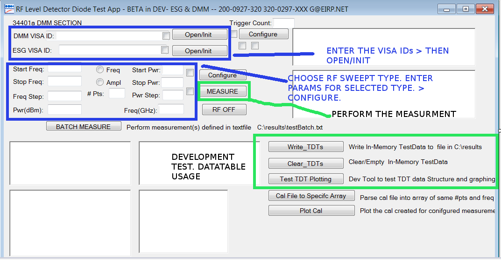

**Project Name:** DMM_ESG_RFtoDCSweeps

**Description:** Automated test app for measuring RF input to DCV output transfer characteristics of 
RF detectors. An ESG RF signal generator, with step/list option, is creates the freq or pwr swept signal. 
Standard 34401 DMM is used to DC level. The ESG trigger output is connected to the DMM external trigger. A square wave transition at each freq or pwr point in the sweep trigger the DVM. Results are stored using in memory DataTables
and presented in Chart object. Several tests can be define in a test file, then performed as a batch of test 
with no user input required[ ie a test sequencer. The project is developed in VS2015 C#, VISA, IVI-COM, WIN7. ( more less concise details in last section of the this page.)

**Table of Contents:**

**Installation:** To install this application on a WIN7 PC, clone to your local machine. Additional components are
required.  The following items should be download and installed. An installer can be created using the VS deploy feature, then installed via the output of deploy. Running in development mode with VS is fine for some scenarios.
* [IVI-COM Shared Components, IVIFoundation](http://www.ivifoundation.org/)
* [Keysight IVI-COM DMM Driver](http://www.keysight.com/main/software.jspx?cc=US&lc=eng&nid=-11143.0.00&id=1494698&pageMode=PV)
* [Keysight IVI-COM RF SigGen Driver](http://www.keysight.com/main/software.jspx?ckey=1669133&lc=eng&cc=US&nid=-11143.0.00&id=1669133)
* [VISA library Keysight](http://www.keysight.com/main/software.jspx?cc=US&lc=eng&ckey=2175637&nid=-536900526.697048.02&id=2175637&cmpid=zzfindiosuitedownload)

**USAGE:** Assuming the application, IVI-COM drivers, and VISA library are installed.
#### SETUP / PARAM ENTRY 
* Connect DVM ext trigger input to RF sig gen Trigger output via BNC.
* Connect RF SigGen O/P to Detector RF input.
* Connect RF detector DC output to DMM input. ...
* Open the app, then open the VISA utility to view devices connected to the PC. 
  * Copy the VISA_ID for the RF SigGen and DMM and paste into the textboxes at the top left of the form. 
* Selecting  desired sweep type, pwr or freq, using the radio box in middle of the form.  
* Enter the start, stop, step size, and Point into textboxes to left or right of the radio boxes.  
* Open and INITialize the DMM and SigGen with command buttons to right of the textboxes 
with VISA_IDs. 
* Configure the ESG for the desired sweep using the "CONFIGURE" Button in middle-right of GUI.
* INITiate a measurement using the "MEASURE" command button. Equipment should go into action then results graph
will popup. 

**EXAMPLE OF FREQUENCY SWEEP RESULTS**
**Results shown in graph used Agilent E4438C  as RF SigGen**

**Video of freq:** An version with slightly different layout is used in the video, but the it includes
entering the VISA_ID, Freq Sweep Params, and the performing a few sweeps.

[Freq Sweep Video](https://www.youtube.com/watch?v=OFMz4BTxJdA&t=0s)

**Contributing:** A secondary purpose of this effort is testing a SQL schema and class definition for test object. 
The SQL schema and test object classes are used in another Test data management application effort. Any ides or insights
about Test data management approach with a bias toward RF and Satcom equipment would be welcomed. 

**Credits:** Players to be named later...

**License:**

**Less Concise Description Parts:**

 C# Desktop test application for characterizing the Rf-to-DC transfer characteristic of typical RF detector diodes. Two pieces of test equipment are used: an ESG Signal Generator, HP34401A or similar DVM. Communication with the DVM and Signal Generator is accomplished with VISA. IVI-COM drivers for the DMM were used for development ease. Code comments sometime include the SCPI equivalent commands to the method and properties accessible with the IVI-COM drivers. DVM external trigger is connected to ESG trigger output. Square Wave transition at each point in ESG swept initiates a DC measurement.

The batch testing feature is inspired by high dollar and heavy PC overhead "test sequencers". The simple lightweight approach allowed for hundred of unattended swept RF to DC transfer measurements to be completed and results graphed in short period. Eventually want to add feature to output/write results to database. Currently experimenting with Relation and MongodB for the data.  Trending towards mongoDB for flexible schema. 

HOpefully other find this and get some utility from the initial branch. 

Check out the pages on the wiki.
